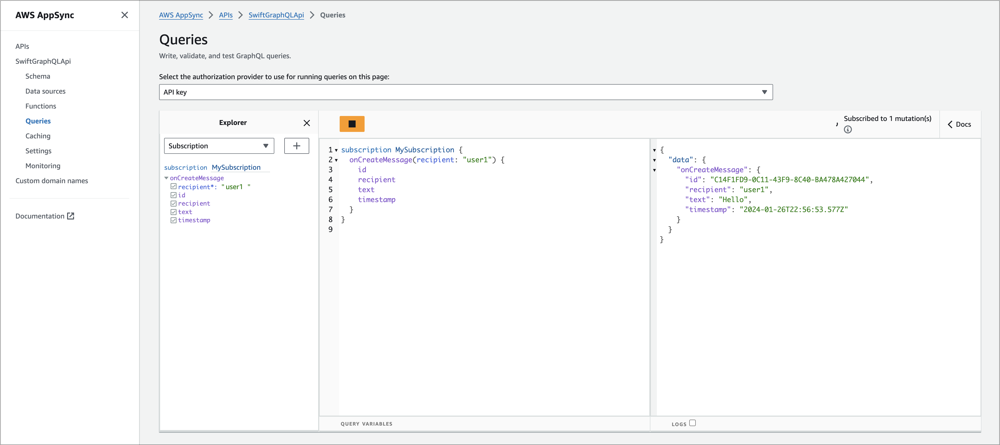

# {{ cookiecutter.project_name }}

This application illustrates how to deploy a Server-Side Swift workload on AWS using the [AWS Serverless Application Model (SAM)](https://aws.amazon.com/serverless/sam/) toolkit. The workload is a GraphQL API for discovering location information. It deploys the API using AWS AppSync. The API methods retrieve location and points of interest from the Amazon Location Service. It also retrieves weather information from a third-party weather provider.

You can use this API as the backend for a mobile or web application that requires location data.

## Architecture


- AppSync receives API requests from a client
- AppSync invokes Lambda functions to process the requests
- Lambda functions written in Swift use the [AWS SDK for Swift](https://aws.amazon.com/sdk-for-swift/) and the [Swift AWS Lambda Runtime](https://github.com/swift-server/swift-aws-lambda-runtime) to retrieve the requested location and weather information

## Prerequisites

To build this sample application, you need:

- [AWS Account](https://console.aws.amazon.com/)
- [AWS Command Line Interface (AWS CLI)](https://docs.aws.amazon.com/cli/latest/userguide/cli-chap-getting-started.html) - install the CLI and [configure](https://docs.aws.amazon.com/cli/latest/userguide/cli-configure-quickstart.html) it with credentials to your AWS account
- [AWS SAM CLI](https://docs.aws.amazon.com/serverless-application-model/latest/developerguide/install-sam-cli.html) - a command-line tool used to create serverless workloads on AWS
- [Docker Desktop](https://www.docker.com/products/docker-desktop/) - to compile your Swift code for Linux deployment to AWS Lambda
- [IQ Air API Key](https://dashboard.iqair.com/) - a 3rd party API used to obtain weather and air quality for a specified location.  Create a free Community Edition API key.

## Build the application

The **sam build** command uses Docker to compile your Swift Lambda functions and package them for deployment to AWS.

```bash
sam build
```

## Deploy the application

Deploying your SAM project creates the Lambda functions, AppSync GraphQL API, and a AWS Secrets Manager secret to store your API Key from the weather service provider.

```bash
sam deploy --guided
```

Accept the default response to every prompt.

## Use the API

At the end of the deployment, SAM displays the endpoint of your GraphQL API and the API Key used for authentication:

```bash
Outputs
------------------------------------------------------------------------------------------------------------
Key                 APIEndpointValue
Description         AppSync API Endpoint
Value               [your-api-endpoint]

Key                 ApiKeyValue
Description         API Key
Value               [your-api-key]

------------------------------------------------------------------------------------------------------------
```

Use cURL or a tool such as [Postman](https://www.postman.com/) to interact with your API. 

Replace **[your-api-endpoint]** with the APIEndpointValue value from the deployment output. 

Replace **[your-api-key]** with the ApiKeyValue value from the deployment output.

### Determine a City

Run this query to find a city based on latitude and longitude.

```bash
curl \
-X POST \
-H "x-api-key: [your-api-key]" \
-H "Content-Type: application/json" \
-d '{ "query": "query { getCity(latitude: 37.33444604, longitude: -122.04187567) { name } }" }' \
[your-api-endpoint]
```

### Find Some Coffee

Run this query to find a coffee shop based on latitude and longitude.

```bash
curl \
-X POST \
-H "x-api-key: [your-api-key]" \
-H "Content-Type: application/json" \
-d '{ "query": "query { getPlaces(latitude: 37.33444604, longitude: -122.04187567, placeType: coffee, maxResults: 10) { name address } }" }' \
[your-api-endpoint]
```

Change the **placeType** to *food* or *fuel* to find other places.

### Determine the Weather

In order to query the weather you must obtain an API Key from [**IQ Air**](https://dashboard.iqair.com/). Signup for a free Community Edition key.

Then update the *SwiftAPIWeatherApiKeySecret* secret with the api key value.

```bash
aws secretsmanager put-secret-value --secret-id SwiftAPIWeatherApiKeySecret --secret-string [your IQ Air API key]
```

Run this query to determine the weather based on latitude and longitude.

```bash
curl \
-X POST \
-H "x-api-key: [your-api-key]" \
-H "Content-Type: application/json" \
-d '{ "query": "query { getWeather(latitude: 37.33444604, longitude: -122.04187567) { aqIndex temperature } }" }' \
[your-api-endpoint]
```

### Send a Message

GraphQL has the capability to send and receive real-time messages between clients called *Subscriptions*.

First, logon the the AWS Console and navigate to the AppSync service. Select your API and navigate to the *Queries* menu option. From there, use the Query Explorer to start a *Subscription* for the *onCreateMessage* mutation event as seen in this screenshot. Select the *Run* button to start the subscription.



Then initiate a *createMessage* mutation with the following cURL command. Make sure the *recipient* value is the same value used in your subscription in Query Explorer.

```bash
curl \
-X POST \
-H "x-api-key: [your-api-key]" \
-H "Content-Type: application/json" \
-d '{ "query": "mutation { createMessage(recipient: \"user1\", text: \"Hello\") { id recipient text timestamp } }" }' \
https://[your-graphql-endpoint]/graphql
```

Your message is displayed in real-time in the results panel of the Query Explorer.


## Test the API Locally
SAM allows you to test your Lambda functions locally on your development machine. Follow these instructions to execute each Lambda function. Further capabilities can be explored in the [SAM Documentation](https://docs.aws.amazon.com/serverless-application-model/latest/developerguide/serverless-sam-cli-using-invoke.html).


**Event Files**

When a Lambda function is invoked, AppSync sends an event to the function with all the provided parameters. When running the functions locally, you pass in a json file to the function that simulates the event data. The **events** folder contains a json file for each function.

**Get City Function**

Update the body parameter in the **events/GetCity.json** file to specify the arguments for your query.

```json
{
  "arguments": {
    "latitude": 37.33444604,
    "longitude": -122.04187567
  }
}
```

Then invoke the function passing in the environment variables and event data:

```bash
sam local invoke GetCityFunction --env-vars env.json --event events/GetCity.json
```

**Get Places Function**

```bash
sam local invoke GetPlacesFunction --env-vars env.json --event events/GetPlaces.json
```

**Get Weather Function**

```bash
sam local invoke GetWeatherFunction --env-vars env.json --event events/GetWeather.json
```

## Cleanup

When finished with your application, use SAM to delete it from your AWS account. Answer **Yes (y)** to all prompts. This will delete all of the application resources created in your AWS account.

```bash
sam delete
```
