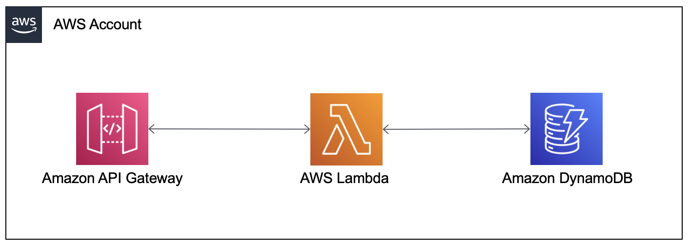

# {{ cookiecutter.project_name }}

This application illustrates how to deploy a Server-Side Swift workload on AWS using the [AWS Serverless Application Model (SAM)](https://aws.amazon.com/serverless/sam/) toolkit. The workload is a REST API for tracking items in a database. It deploys the API using Amazon API Gateway. The API methods store and retrieve data in a Amazon DynamoDB database using AWS Lambda functions.

## Architecture



- Amazon API Gateway receives API requests
- API Gateway invokes Lambda functions to process POST, PUT, GET, and DELETE events
- Lambda functions written in Swift use the [AWS SDK for Swift](https://aws.amazon.com/sdk-for-swift/) and the [Swift AWS Lambda Runtime](https://github.com/swift-server/swift-aws-lambda-runtime) to retrieve and save items to the database

## Prerequisites

To build this sample application, you need:

- [AWS Account](https://console.aws.amazon.com/)
- [AWS Command Line Interface (AWS CLI)](https://docs.aws.amazon.com/cli/latest/userguide/cli-chap-getting-started.html) - install the CLI and [configure](https://docs.aws.amazon.com/cli/latest/userguide/cli-configure-quickstart.html) it with credentials to your AWS account
- [AWS SAM CLI](https://docs.aws.amazon.com/serverless-application-model/latest/developerguide/install-sam-cli.html) - a command-line tool used to create serverless workloads on AWS
- [Docker Desktop](https://www.docker.com/products/docker-desktop/) - to compile your Swift code for Linux deployment to AWS Lambda

## Build the application

The **sam build** command uses Docker to compile your Swift Lambda functions and package them for deployment to AWS.

```bash
sam build
```

## Deploy the application

Deploying your SAM project creates the Lambda functions, API Gateway, and DynamoDB database in your AWS account.

```bash
sam deploy --guided
```

Accept the default response to every prompt, except the following warnings:

```bash
CreateItem may not have authorization defined, Is this okay? [y/N]: y
GetItems may not have authorization defined, Is this okay? [y/N]: y
GetItem may not have authorization defined, Is this okay? [y/N]: y
UpdateItem may not have authorization defined, Is this okay? [y/N]: y
DeleteItem may not have authorization defined, Is this okay? [y/N]: y
```

The project creates a publicly accessible API endpoint. These are warnings to inform you the API does not have authorization. If you are interested in adding authorization to the API, please refer to the [SAM Documentation](https://docs.aws.amazon.com/serverless-application-model/latest/developerguide/sam-resource-httpapi.html).

## Use the API

At the end of the deployment, SAM displays the endpoint of your API Gateway and DynamoDB table name:

```bash
Outputs
----------------------------------------------------------------------------------------
Key                 SwiftAPIEndpoint
Description         API Gateway endpoint URL for your application
Value               https://[your-api-id].execute-api.[your-aws-region].amazonaws.com

Key                 SwiftAPITable
Description         DynamoDB Table Name
Value               sam-app-SwiftAPITable-[table id]     
----------------------------------------------------------------------------------------
```

Use cURL or a tool such as [Postman](https://www.postman.com/) to interact with your API. Replace **[your-api-endpoint]** with the SwiftAPIEndpoint value from the deployment output.

**Create a To Do List item**

```bash
curl --request POST https://[your-api-endpoint]/item --header 'Content-Type: application/json' --data-raw '{"itemName": "my todo item"}'
```

**Retrieve all To Do List items**

```bash
curl https://[your-api-endpoint]/items
```

**Retrieve a specific To Do List item**

*Replace [item id] with the id of the item you want to retrieve*

```bash
curl https://[your-api-endpoint]/item/[item id]
```

**Update a specific To Do List item**

*Replace [item id] with the id of the item you want to update*

```bash
curl --request PUT https://[your-api-endpoint]/item/[item id] --header 'Content-Type: application/json' --data-raw '{"itemName": "my updated todo item"}'
```

**Delete a specific To Do List item**

*Replace [item id] with the id of the item you want to delete*

```bash
curl --request DELETE https://[your-api-endpoint]/item/[item id]
```

## Test the API Locally
SAM also allows you to execute your Lambda functions locally on your development computer. Follow these instructions to execute each Lambda function. Further capabilities can be explored in the [SAM Documentation](https://docs.aws.amazon.com/serverless-application-model/latest/developerguide/serverless-sam-cli-using-invoke.html).

First, you must update the **env.json** file to specify the name of the DynamoDB table that SAM created in your AWS account. This value was output at the end of the *sam deploy* step.  This file sets the environment variables passed to the Lambda function at runtime. The functions use this environment variable to identify the name of the DynamoDB table in which to store your data.

**env.json**
```
{
  "Parameters": {
      "TABLE_NAME": "<YOUR TABLE NAME>"
  }
}
```

**Event Files**

When a Lambda function is invoked, API Gateway sends an event to the function with all the data packaged with the API call. When running the functions locally, you pass in a json file to the function that simulates the event data. The **events** folder contains a json file for each function.

**Create a To Do List item**

Update the body parameter in the **events/CreateItem.json** file to specify the itemName you want to create.

```json
{
  "body": "{\"itemName\": \"My New Item\"}"
}
```

Then invoke the function passing in the environment variables and event data:

```bash
sam local invoke CreateItem --env-vars env.json --event events/CreateItem.json
```

**Retrieve all To Do List items**

*you do not have to update the events/GetItems.json as the function does not utilize any variable parameters*

```bash
sam local invoke GetItems --env-vars env.json --event events/GetItems.json
```

**Retrieve a specific To Do List item**

*Update the value of *id* to specify the id of an item your created.*

events/GetItem.json

```json
{
  "pathParameters": {
    "id": "id-of-the-item-to-retrieve"
  }
}
```

```bash
sam local invoke GetItem --env-vars env.json --event events/GetItem.json
```

**Update a specific To Do List item**

*Update the value of *id* to specify the id of an item your created.*

events/UpdateItem.json

```json
{
  "pathParameters": {
        "id": "id-of-the-item-to-update"
  },
  "body": "{\"itemName\": \"Updated Item Name\"}",
}
```

```bash
sam local invoke UpdateItem --env-vars env.json --event events/UpdateItem.json
```

**Delete a specific To Do List item**

*Update the value of *id* to specify the id of an item your created.*

events/DeleteItem.json

```json
{
  "pathParameters": {
    "id": "id-of-the-item-to-delete"
  }
}
```

```bash
sam local invoke DeleteItem --env-vars env.json --event events/DeleteItem.json
```

## Cleanup

When finished with your application, use SAM to delete it from your AWS account. Answer **Yes (y)** to all prompts. This will delete all of the application resources created in your AWS account.

```bash
sam delete
```
